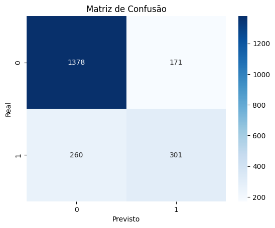

# modelo-previsao-churn-python
Modelo de Machine Learning com Python para prever churn (cancelamento) de clientes. Utiliza Scikit-learn, Pandas e análise exploratória de dados.
# Modelo Preditivo de Churn de Clientes com Python e Scikit-Learn

Este repositório contém um projeto completo de Data Science para prever a probabilidade de um cliente cancelar seu serviço (churn), utilizando um dataset público de uma empresa de telecomunicações.

---

## 🎯 Problema de Negócio

O "churn" de clientes (taxa de cancelamento) é uma das métricas mais críticas para empresas de serviços recorrentes, como telecomunicações, bancos digitais e streamings. Adquirir um novo cliente custa muito mais do que manter um existente.

O objetivo deste projeto é construir um **modelo de Machine Learning** que consiga identificar, com antecedência, os clientes com maior propensão ao churn. Com essa informação, a empresa pode criar ações de retenção direcionadas e proativas (ex: ofertas especiais, contato do suporte), reduzindo perdas de receita e melhorando a satisfação do cliente.

---

## 🛠️ Metodologia e Ferramentas

O projeto segue o ciclo de vida padrão de um projeto de ciência de dados:

1.  **Análise Exploratória de Dados (EDA):** Investigação inicial dos dados para entender a distribuição do churn e a relação entre as variáveis.
2.  **Pré-processamento e Limpeza de Dados:** Transformação de variáveis categóricas em numéricas (One-Hot Encoding) e tratamento de valores ausentes para preparar o dataset para o modelo.
3.  **Treinamento do Modelo:** Divisão dos dados em conjuntos de treino e teste e treinamento de um modelo de **Regressão Logística**, um algoritmo clássico e interpretável para problemas de classificação.
4.  **Avaliação de Performance:** Medição da eficácia do modelo utilizando métricas como **Acurácia**, **Relatório de Classificação (Precisão, Recall, F1-Score)** e a visualização da **Matriz de Confusão**.

*   **Linguagem:** Python
*   **Bibliotecas:** Pandas, Matplotlib, Seaborn, Scikit-learn.
*   **Ambiente:** Jupyter Notebook.
*   **Dataset:** [Telco Customer Churn](https://www.kaggle.com/datasets/blastchar/telco-customer-churn) do Kaggle.

---

## 📈 Resultados e Conclusões

O modelo de Regressão Logística treinado alcançou uma **acurácia geral de 80.40%** no conjunto de teste.

*   O modelo demonstrou alta **precisão** ao prever clientes que **não** dariam churn, acertando a grande maioria dos casos.
*   O principal ponto de melhoria é o **"recall"** para os clientes que **sim** dão churn. Isso significa que, embora a maioria das previsões de churn estivesse correta, o modelo ainda deixou de identificar uma parte dos clientes que realmente cancelaram.

**Conclusão de Negócio:**
O modelo, mesmo em sua versão inicial, já é uma ferramenta valiosa. Ele pode ser usado para gerar uma lista de clientes com alta probabilidade de churn, permitindo que a equipe de retenção foque seus esforços de forma muito mais eficiente do que agindo aleatoriamente.

---

## 🚀 Como Executar o Projeto

1.  Clone este repositório.
2.  Instale as dependências: `pip install pandas matplotlib seaborn scikit-learn`.
3.  Coloque o arquivo `churn_data.csv` na pasta raiz.
4.  Abra e execute o Jupyter Notebook `modelo_previsao_churn.ipynb`.
